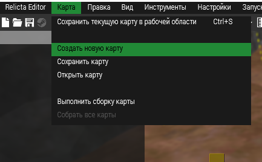

# Создание режима

Ознакомившись с основами редактора перейдем к созданию режима. Любому режиму для работы требуется карта и объекты на ней (например точки спавна).
Перейдите в раздел меню `Карта` и нажмите `Создать новую карту`



Обратите внимание, что после создания новой карты она изначально будет загружена в рабочую область, поэтому предварительно сохраните и скомпилируйте текущую карту если это необходимо.


При создании появится окно загрузки после чего редактор будет перезапущен с новой картой.


После загрузки вам будет предложено ввести имя вашей новой карты.


Вводим название нашей карты. В серии руководств по созданию режимов и ролей мы будем использовать карту SampleMap. Нажимаем зеленую кнопку `Создать` и появляемся в привычном окне редактора.

Для начала построим небольшую сцену из земли. Обратите внимание, что верхние блоки мы поместили в слой `Потолок`, чтобы скрыть его на момент редактирования. Попробуйте самостоятельно поместить блоки потолка в отдельный слой. Подробнее о том как это сделать вы можете повторно посмотреть в [разделе о слоях](Editor_basics.md#список-объектов-и-слои)


Наша замечательная карта, по которой можно передвигаться завершена! Давайте наконец создадим для неё игровой режим!

Переходим в раздел меню `Инструменты` и выбираем `Создать режим`.


В открывшемся окне вводим название нашего режима. Префикс `GM` можно не писать, он добавится автоматически если вы его не указали.


Нажимаем `Ок`. Сгенерируются файлы режима и базовой роли для него. После этого новый режим с ролью добавится в библиотеку классов и наш режим будет создан с именем `GMSampleGamemode`.

Наш режим создан в папке `Src\host\GameModes` в виде папки с аналогичным именем, которое мы указали в предыдущем окне. Внутри этой папки изначально лежат 3 файла:
- **GMSampleGamemode.sqf** - Собственно описание класса нашего режима.
- **GMSampleGamemode_roles.sqf** - Описание базовой роли для нашего режима. Сюда же мы будем вписывать свои роли, про создание которых описано [в руководстве по созданию ролей](Editor_roles.md)
- **loader.hpp** - загрузчик всех файлов режима. Если мы добавляем свои файлы, относящиеся к режиму или например хотим отсортировать роли нашего режима по разным файлам, то все эти файлы так же должны быть дозагружены через loader.hpp.


# Разработка режима

Итак, откроем в редакторе VS Code файл **GMSampleGamemode.sqf**


В сгенерированном файле режима уже автоматически установлено его название и название нашей созданной карты. 

Строчка `#include <..\GameMode.h>` означает **подняться на директорию выше** и вставить содержимое из файла `GameMode.h` в целевой файл. Нужна она для того, чтобы нам не подключать массу различных заголовочных файлов для полной работы. Мы просто подключили GameMode.h и больше не паримся...

Дальше написан `editor_attribute("CodeOnyGamemode")`. Не придавайте этому особого значения. Это просто атрибут для режима редактора, который помечат класс как режим, разрабатываемый через код.

На следующей строке идёт определение (*декларация*) класса нашего игрового режима. Обратите внимание, что класс наследует логику от `GMBase`. GMBase - это базовый класс игрового режима, который поддерживает основную логику и предоставляет полезные функции. Вы можете ознакомиться с содержимым базового режима GMBase для ознакомления со всеми возможными полями и методами. Там они так же хорошо задокументированы как и в сгенерированном режиме, но в более системном формате.

Любой режим должен иметь название, описание и наверное какую-то продолжительность игры. Укажем в полях (переменных класса) имя режима (**name**), описание (**desc**), доступное при выборе администратором или через голосование а также расширенное описание (**descExtended**), показываемое в конце раунда. 

Продолжительность игры задается через поле продолжительности (**duration**), указываемое в секундах. Чтобы конвертировать секунды в минуты, нужно умножить количество минут на 60. Например, режим, длительностью 45 минут можно было бы определить таким образом: `var(duration,60*45);`.
Однако для дополнительного удобства в заголовочном файле `engine.hpp`, который кстати уже подключен в `GameMode.h` существет несколько полезных макросов для работы со временем:
- t_asMin(s) - Преобразуер значение s минут в секунды. 
```sqf
t_asMin(45); // 2700 секунд
```
- t_asHrs(s) - Преобразует значение s часов в секунды.
```sqf
t_asHrs(2); // 7200 секунд
```

