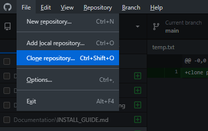
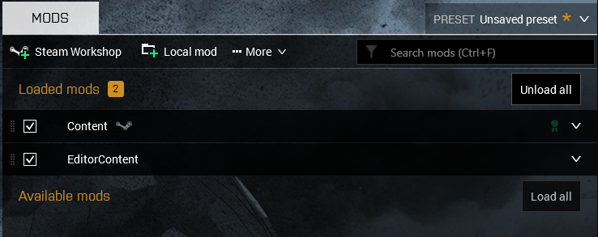

# Руководство по установке ReSDK_A3

Данное руководство предназначено для новых пользователей, желающих внести вклад в разивтие проекта ReSDK_A3.

# Получение репозитория
Для работы над кодом необходимо установить git-клиент. Для новых пользователей рекомендуем [Github Desktop](https://desktop.github.com/)

> Если до этого вы не работали в Github, то вам так же потребуется учетная запись Github.

Скачиваем Github Desktop, устанавливаем и запускаем.

Затем сделайте **форк** репозитория ReSDK_A3 на GitHub, нажав на кнопку "Fork" в правом верхнем углу страницы проекта. Это создаст копию проекта в вашем аккаунте GitHub.

После клонирования в Github Desktop жмем **File** и **Clone repository**



В открывшемся окне выбираем ваш репозиторий. Он будет называться как ВАШ_GITHUB_НИК\ReSDK_A3.vr


## Выбор пути для репозитория

Путь, куда должен быть сохранён репозиторий это папка missions, лежащая в документах вашего пользователя.
Если у вас только один профил Arma 3, то сохраняйте по путь должне быть такой:
```
C:\Users\Admin\Documents\Arma 3\missions\ReSDK_A3.vr
```
Если же профилей несколько, то такой:
```
C:\Users\Admin\Documents\Arma 3 - Other Profiles\YOUR_ARMA_PROFILE\missions\ReSDK_A3.vr
```
Вместо YOUR_ARMA_PROFILE должно быть имя вашего профиля. Посмотреть список профилей можно в настройках лаунчера


После клонирования репозитория в указанной папке появится наша версия репозитория, независимая от версий, над которыми работают другие пользователи.

# Установка мода редактора
Для работы всех компонентов редактора потребуется установить мод @EditorContent. Сделать это можно двумя способами:
* [Развернуть сборку через ReMaker](#Установка-мода-через-ReMaker)
* [Вручную установить мод](#Установка-мода-вручную)

## Установка мода через ReMaker
Заходим в папку ReMaker в корне нашего скопированного репозитория. Там запускаем файл `DEPLOY.bat`, либо через командную строку запускаем ReMaker с аргументом `deploy`.
> После запуска в папке ReMaker автоматически будет создан файл `config.ini`, в котором хранятся все основные пути.

Во время установки ReMaker предложит ввести путь до папки с установленной Arma3


Вставляем туда путь до платформы Arma 3 и нажимаем Enter. Результат выполнения данной команды должен быть таким же как на изображении ниже:


Если после ввода пути в окне консоли появился красный текст как на изображении ниже, то вы указали неверный путь до папки с Arma 3


В результате успешной установки через ReMaker в вашей папке с Arma 3 появится папка `@EditorContent` в которой хранятся библиотеки, необходимые для работы ReSDK.

## Установка мода вручную
1. Создаем в вашей папке с Arma 3 папку `@EditorContent`. Обязательно с таким именем, другие имена не допускаются.
2. Содержимое папки `ReMaker/Deploy` копируем в `@EditorContent`
3. Готово, однако при каждом обновлении библиотек в `ReMaker/Deploy` операцию по копированию придется делать повторно.

# Подключение мода в лаунчере Arma 3
Запускаем лаунчер Arma 3 и нажимаем кнопку добавления локального мода и указываем папку с `@EditorContent`


После этого ставим галочки напротив [мода реликты](https://download.relicta.ru) и нашего `@EditorContent`



# Подключение базы данных
Проект использует файловую базу на основе sqlite.
В проекте откройте файл `src\host\Database\SQLite\SQLite.h` любым текстовым редактором и измените путь до базы данных 
Вероятнее всего ваш путь будет выглядеть как-то так:
```
`C:\Program Files\Steam\Steamapps\Common\Arma 3\@EditorContent\db\GameMain.db`
```
И в итоге должно получиться:
```sqf
// ======================================================
// Copyright (c) 2017-2023 the ReSDK_A3 project
// sdk.relicta.ru
// ======================================================


#define dbRequest "sqlitenet" callExtension 

#ifdef EDITOR
	#define DB_PATH "C:\Program Files\Steam\Steamapps\Common\Arma 3\@EditorContent\db\GameMain.db"
#else
	#define DB_PATH "C:\Games\Arma3\A3Master\@server\db\GameMain.db"
#endif
```


# Запуск

**Для работы @EditorContent обязательно требуется отключить Battleye**


Так же можно изменить параметры в лаунчере:


- Пропускать логотип - немного ускоряет загрузку платформы
- Включить оконный режим - особенность при работе с SDK, связанная с постоянной сменой с окна Arma 3 на редактор или информационное окно кода и обратно.
- Профиль - если у вас несколько профилей Arma 3, то нужно указать тот, в папку которого вы клонировали репозиторий (YOUR_ARMA_PROFILE), [подробнее выше](##Выбор-пути-для-репозитория)
- Файл задания (редактор) - можно указать тут путь до файла `missions.sqm` в корне нашего репозитория если хотите, чтобы при запуске Arma 3 сразу запускался редактор ReEditor.

После всех манипуляций с лаунчером нажимаем кнопку **Запуск с модами**. Как и обычно нужно подождать некоторое время пока загрузится Arma 3, после чего в главном меню нажимаем *"редактор"*, выбираем любую карту и жмем *"далее"*. Когда редактор загрузится сверху нажимаем *"Сценарий"* и *"Открыть"*. Выбираем ReSDK_A3 и жмем открыть.
> Обратите внимание, что если в параметрах лаунчера вы указали *Файл задания*, то после запуска Arma 3 вы сразу попадёте на выбранную карту.

# Дальнейшие действия

Рекомендуем ознакомиться со следующими разделами
[Базовая документация по архитектуре](PROJECT_ARCHITECTURE.md) - для понимания как устроен проект и как он работает
[Руководство по программированию](ScriptingGuides/README.md) - для тех, кто хочет заняться созданием игровой логики, нового функционала или исправлением текущего.
